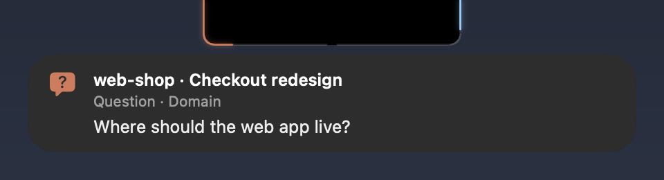
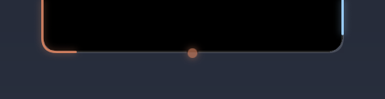
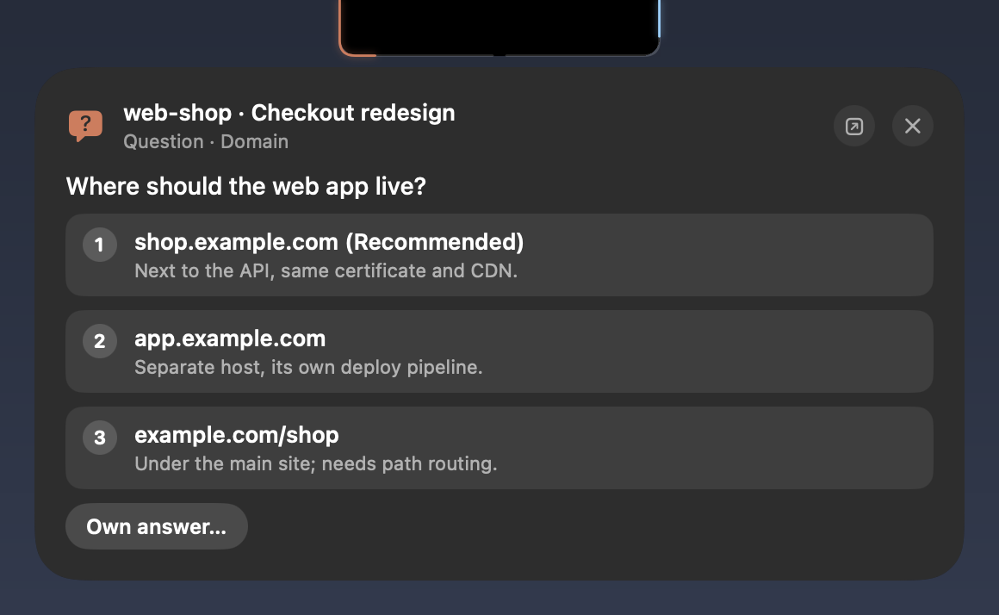
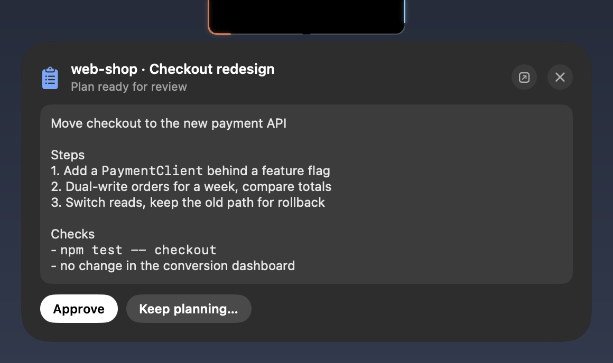
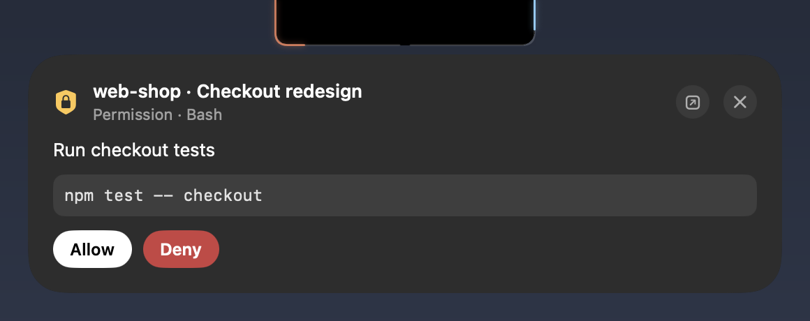
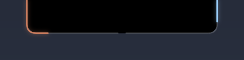
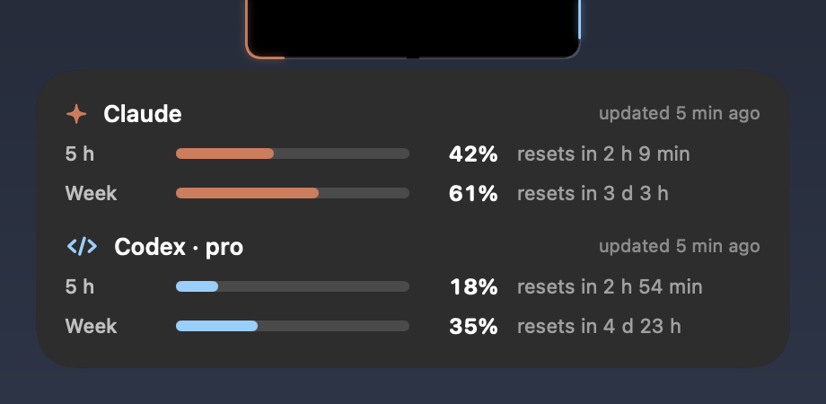

# Claude Notify

[English](README.md) · **Русский**

Приложение говорит по-английски и по-русски: язык берётся из системы, его можно задать ключом `language` в настройках.

Помощник для [Claude Code](https://code.claude.com) в чёлке MacBook. Когда сессия, которой **нет у вас на экране**, задаёт вопрос, готовит план или просит разрешение, запрос выпадает из чёлки, и ответить можно прямо там, не переключая окна. Ещё чёлка показывает лимиты Claude и Codex.

- **Ответы из чёлки** — варианты с описаниями, свой ответ, несколько вариантов сразу, несколько вопросов подряд; одобрить план или вернуть его с замечаниями; разрешить или запретить инструмент
- **Только когда не видно** — для сессии, на которую вы смотрите, ничего не всплывает (активное приложение, заголовок окна IDE, вкладка терминала); стоит отойти — придёт всё
- **Понятный контекст** — проект (worktree как `repo / worktree`), название сессии (`/rename` или автоматическое), что именно спрашивают
- **Лимиты на контуре чёлки** — тонкая линия вокруг выреза заполняется расходом Claude (слева) и Codex (справа); наведите на чёлку, чтобы увидеть проценты и время сброса
- **Только чёлка** — в Центр уведомлений ничего не падает; с ключом `system_notifications` через 20 с без реакции придёт ещё и обычное уведомление macOS с теми же вариантами
- **«Готово»** — короткий баннер, когда долгий ход (от 1 мин) закончился в сессии, на которую вы не смотрите
- **Официальные хуки** — построено на хуке Claude Code `PermissionRequest`; собственный диалог сессии остаётся, побеждает первый ответ
- **Без зависимостей** — Swift-приложение собирается из исходников, хук на Python 3.9+ без сторонних пакетов

## Скриншоты

Интерфейс на скриншотах английский; на русской системе он русский.

Вопрос из сессии, на которую вы не смотрите, выпадает из чёлки, а потом сворачивается в точку на контуре:

<p> </p>

Наведите на чёлку, чтобы ответить, одобрить план или разрешить инструмент:

<p></p>
<p></p>
<p></p>

Когда ничего не ждёт, чёлка показывает лимиты: контур заполняется расходом Claude (слева) и Codex (справа), цифры — по наведению:

<p> </p>

## Как это работает

```
Claude Code ── плагин "claude-notify" (хуки) ──► claude-notify-hook.py
                                                     │ Unix-сокет (0600)
                                                     ▼
                          Claude Notifier.app (LaunchAgent)
                            ├─ видна ли сессия на экране?
                            ├─ чёлка: лимиты · баннер · стеклянная карточка с ответами
                            └─ уведомление macOS как запасной путь
```

- Ждёт ответа только хук `PermissionRequest`. Claude Code одновременно показывает свой диалог, поэтому ответ в самой сессии работает как обычно и отпускает хук.
- Остальные хуки работают в режиме `async` — Claude их не ждёт.
- Запуски без интерфейса (`claude -p`, Agent SDK) пропускаются.

## Установка

```bash
git clone https://github.com/veeskelad/claude-notify.git
cd claude-notify
./scripts/install.sh --with-plugin
```

Установщик собирает `Claude Notifier.app` в `~/.local/share/claude-notify/`, запускает его как LaunchAgent, создаёт `~/.config/claude-notify/config.json`, а с ключом `--with-plugin` регистрирует этот репозиторий как маркетплейс плагинов и ставит плагин `claude-notify`. Без ключа он выводит две команды:

```bash
claude plugin marketplace add /path/to/claude-notify
claude plugin install claude-notify@claude-notify
```

Хуки подхватят новые сессии Claude Code; уже открытые нужно перезапустить.

**Разрешения** («Системные настройки»):
- «Уведомления» → Claude Notifier → разрешить, стиль «Предупреждения»
- «Конфиденциальность и безопасность» → «Универсальный доступ» → Claude Notifier — чтобы читать заголовок активного окна IDE. Без этого активная IDE считается за «вы смотрите».

**Чтобы доступ не слетал после переустановки.** macOS привязывает разрешение к подписи приложения. Подпись по умолчанию (ad-hoc) меняется с каждой сборкой, поэтому после `./install.sh` переключатель горит, но уже не действует. Самоподписанный сертификат решает это один раз:
1. «Связка ключей» → «Ассистент сертификации» → «Создать сертификат…» → имя `Claude Notify Local Signing`, тип идентификации «Самоподписанный корневой», тип сертификата «Подпись кода».
2. Запустите `./install.sh`: если сертификат есть, установщик подпишет им (разрешите `codesign` пользоваться ключом, если спросит).
3. В «Универсальном доступе» удалите старую строку Claude Notifier кнопкой «−» и включите новую. Следующие переустановки её сохранят.

### Лимиты

Лимиты Codex берутся у самого Codex: раз в несколько минут и при наведении на чёлку приложение спрашивает у `codex app-server` лимиты аккаунта (те же данные, что показывают приложения Codex), так что учитывается и работа с других машин и в облаке. Нужен CLI `codex`, вошедший через ChatGPT; вход остаётся внутри Codex. Без него показываются последние лимиты из логов сессий Codex (`~/.codex/sessions`).

Лимиты Claude берутся у самого Claude Code: когда активна любая сессия Claude Code (в терминале или IDE) и при наведении на чёлку, приложение спрашивает у CLI `claude` расход аккаунта через служебный запрос SDK `get_usage` — без интерфейса, без ваших хуков и MCP-серверов, без вызова модели и без сохранения сессии. Нужен `claude`, вошедший с подпиской Claude. Подкармливать чёлку может и статуслайн (тогда терминальные сессии обновляют её при каждой отрисовке); добавьте в конец скрипта статуслайна (того, что в `statusLine.command`; нужен `jq`):

```bash
# Claude Notify: share rate limits with the notch
rl=$(echo "$input" | jq -c 'select(.rate_limits != null) | {rate_limits, updated_at: (now | floor)}' 2>/dev/null)
if [ -n "$rl" ]; then
  cn_dir="$HOME/Library/Application Support/claude-notify"
  mkdir -p "$cn_dir" 2>/dev/null && printf '%s\n' "$rl" > "$cn_dir/.limits-claude.$$" 2>/dev/null \
    && mv -f "$cn_dir/.limits-claude.$$" "$cn_dir/limits-claude.json" 2>/dev/null || true
fi
```

`$input` — JSON, который скрипт прочитал из stdin. Лимиты есть только у подписок Pro/Max и появляются после первого ответа в сессии.

### Требования

- macOS 13+ (Liquid Glass на macOS 26, до него — размытый материал)
- Claude Code с хуками плагинов (проверено на 2.1.284)
- Python 3.9+ в `PATH`
- Xcode Command Line Tools (`xcode-select --install`)

### Удаление

```bash
./scripts/install.sh --uninstall
```

## Настройки

`~/.config/claude-notify/config.json`:

```json
{
  "sounds": { "question": "Glass", "plan_ready": "Glass", "tool_permission": "Funk", "idle": "Pop", "attention": "Funk", "error": "Basso" },
  "events": { "question": true, "plan_ready": true, "tool_permission": true, "idle": true, "attention": true, "error": true },
  "notch": true,
  "system_notifications": false,
  "notch_fallback_seconds": 20,
  "done_min_turn_seconds": 60,
  "away_idle_seconds": 120,
  "activate_app": "auto",
  "language": "auto"
}
```

| Ключ | Что значит |
|------|------------|
| `events.question` / `plan_ready` / `tool_permission` | Вопросы, планы, разрешения на инструменты |
| `events.idle` | «Готово» после долгого хода |
| `events.attention` / `error` | Claude ждёт чего-то другого (форма MCP, сетевой запрос из песочницы) / ход упал с ошибкой API |
| `sounds.*` | Название звука macOS для события, `"none"` — без звука |
| `notch` | `false` → только уведомления macOS |
| `system_notifications` | `true` → ещё и уведомления macOS: запрос через `notch_fallback_seconds`, «Готово», пока вас нет. По умолчанию выключено; при `notch: false` включено всегда |
| `notch_fallback_seconds` | Через сколько секунд неотвеченный запрос дублируется уведомлением macOS (при `system_notifications`) |
| `done_min_turn_seconds` | Ходы короче этого «Готово» не присылают |
| `away_idle_seconds` | Столько без клавиатуры и мыши → все сессии считаются не на экране |
| `activate_app` | `"auto"` (приложение определяется для каждой сессии) или bundle ID |
| `language` | `"auto"`, `"en"` или `"ru"` |
| `claude_path` | CLI `claude` для лимитов Claude; пусто — ищется в Homebrew, `/usr/local/bin`, `~/.local/bin` |
| `codex_path` | CLI `codex` для лимитов Codex; пусто — ищется в Homebrew, `/usr/local/bin`, `~/.local/bin` |

Ключи v2 (`debounce_seconds`, `idle_threshold_seconds`, `permission_threshold_seconds`) игнорируются. После правки настроек перезапустите приложение:

```bash
pkill -f "Claude Notifier.app/Contents/MacOS/claude-notifier"
```

LaunchAgent поднимет его в течение 10 с, а ждавшие вопросы вернутся сами. (`launchctl kickstart -k` перезапускает только обёртку `open -W`, которая снова цепляется к работающему приложению.)

## Если что-то не так

- **Ничего не появляется** — `pgrep -fl claude-notifier` должен показать процесс с `-daemon`; смотрите `~/Library/Logs/claude-notify/notifier.log` и `hook.log`.
- **Хук не срабатывает** — в `claude plugin list` плагин `claude-notify` должен быть включён; перезапустите сессию.
- **Попробовать, не трогая установленное приложение** — `open -n -a "Claude Notifier.app" --env CLAUDE_NOTIFY_HOME=/tmp/cn --env CLAUDE_NOTIFY_FORCE_OFFSCREEN=1 --args -daemon` запускает отдельный экземпляр со своим сокетом, настройками и логами в `/tmp/cn`; вход хука ему отправляйте с `HOME=/tmp/cn`.
- **Карточки появляются для окна, на которое вы смотрите** — выдайте «Универсальный доступ»; `[init] accessibility=false` в логе при включённом переключателе значит, что разрешение относится к старой сборке (см. «Чтобы доступ не слетал после переустановки»).
- **Клик по уведомлению открывает не то окно** — укажите в `activate_app` bundle ID своей IDE.

## Лицензия

[MIT](LICENSE)
